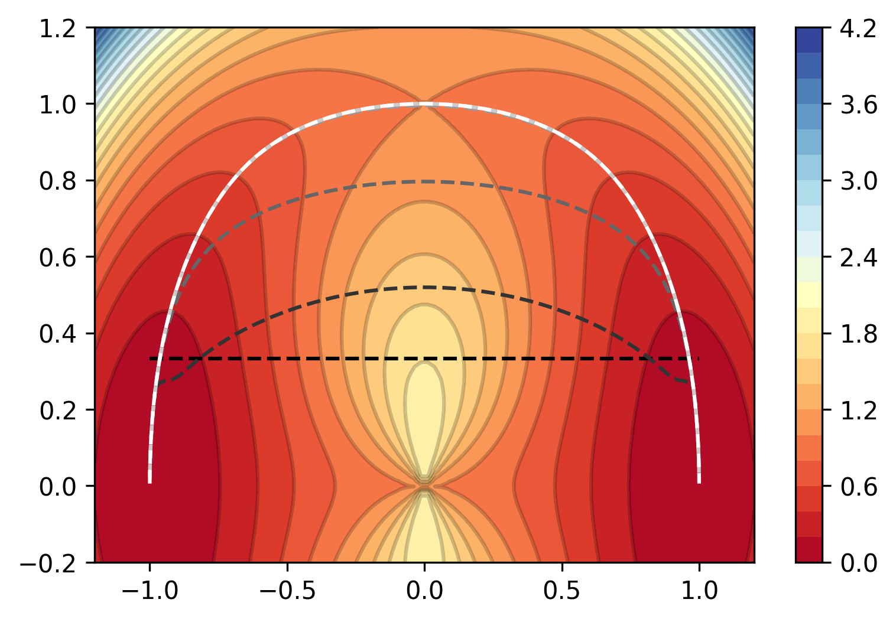

# stringmethod
Python implementation of the string method to compute the minimum energy path between two points on a 2-dimensional energy landscape.

[](https://www.python.org/downloads/release/python-370/)
[](https://google.github.io/styleguide/pyguide.html)



## Installation

1. Install requirements

```sh
pip install -r requirements.txt
```

2. Install package

```sh
pip install .
```

## Usage

See the Jupyter notebooks in the `examples/` directory.
